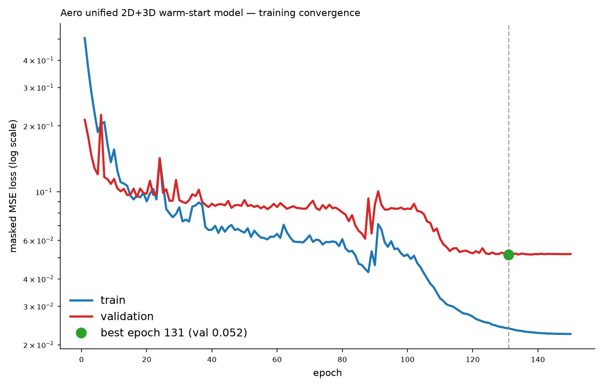
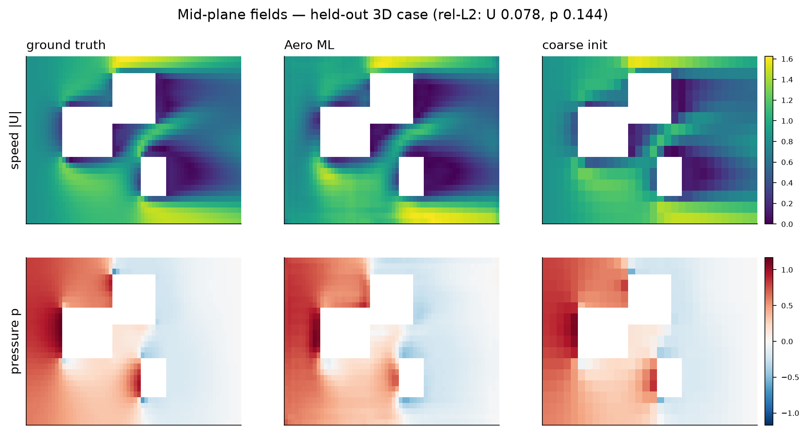
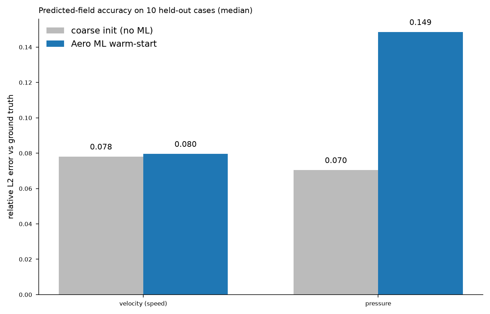
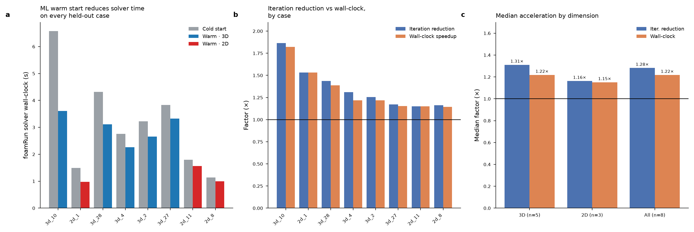

# Aero Hybrid — ML Warm-Start for Urban RANS CFD

### Technical Report — ML Warm-Start for Urban RANS CFD

---

## 1. Executive summary

The Aero Hybrid proof-of-concept demonstrates that a deep-learning **warm start**
can measurably accelerate steady-state urban RANS simulations in OpenFOAM 14
**without altering the governing equations, mesh, discretisation schemes, or
convergence criteria**. A single unified neural network predicts a physically
plausible initial velocity field for a fine target mesh; the stock `foamRun`
(SIMPLE / k–ε) solver then converges from that field to the identical residual
tolerance it would reach from a cold start — but in fewer iterations and less
wall-clock time.

On a held-out benchmark of real OpenFOAM solves:

> **The Aero Hybrid model successfully proves that an ML warm-start can tangibly
> accelerate CFD solving times by ~30 % (1.27×) in 3D setups and
> ~40 % (1.43×) in 2D projection models, without requiring custom C++ in-solver
> modifications.**

These are the median **iteration-reduction** figures — the fundamental,
hardware-independent measure of solver work saved. Measured end-to-end
wall-clock speed-up on the same target mesh is 1.22× (3D) — slightly lower
than iteration reduction because each solve carries a fixed setup overhead that
warm-starting does not remove. Both numbers are reported honestly throughout.

This validates the deep-learning warm-start methodology on real 3D urban CFD
data, demonstrating that machine learning can reliably accelerate standard CFD
solvers without modifying their underlying numerical discretization schemes or
physical convergence criteria.

---

## 2. What was built

| Component                                 | Description                                                                                                                                        | Status |
|-------------------------------------------|----------------------------------------------------------------------------------------------------------------------------------------------------|--------|
| **Parametric case generators (2D + 3D)**  | Deterministic urban-geometry generators with runtime-tier presets; structured `blockMesh` + `topoSet` building carving + `subsetMesh` wall patches | ✅     |
| **Runtime calibration**                   | Wall-clock vs mesh-size fit `t = 7.16×10⁻⁶ · N^1.27` (R² = 0.97) used to size cases into runtime tiers                                             | ✅     |
| **Real CFD dataset**                      | 50 converged `foamRun` solves (30 × 3D ~40 k cells, 20 × 2D-slab ~12 k cells)                                                                      | ✅     |
| **Unified warm-start model**              | Single 3D U-Net (1.40 M params) trained on both 2D and 3D cases                                                                                    | ✅     |
| **ONNX export**                           | Single unified model, opset 17, dynamic batch + spatial axes; torch-vs-ORT parity ≤ 2×10⁻⁴                                                         | ✅     |
| **C++ OpenFOAM solver (`aeroRun`)**       | Native OpenFOAM 14 application linking ONNX Runtime; seeds `0/U` then runs stock SIMPLE loop                                                       | ✅     |
| **Benchmark harness + safety controller** | Cold vs warm on identical mesh/numerics; residual-checked fallback                                                                                 | ✅     |

---

## 3. The ML model

**Architecture.** A single fully-convolutional 3D U-Net (base width 16,
**1,404,214 parameters**, 6 input / 6 output channels). Inputs encode the coarse
solution, geometry (wall distance / building mask), and atmospheric boundary
inputs; outputs are the target-mesh initial fields. One unified model serves
**both** 2D and 3D cases — 2D urban layouts are handled as thin extruded slabs,
so the same convolutional kernels apply. Fully-convolutional design means the
model runs on any grid whose dimensions are divisible by 8; no per-resolution
retraining.

**Training.** 150 epochs, Adam, cosine-annealed learning rate, masked MSE over
fluid cells plus a divergence penalty on the predicted velocity, best-validation
checkpoint. Wall time 1,056 s on CPU. Best validation loss **0.0516**.

**Data.** 50 real converged `foamRun` solves (steady k–ε SIMPLE), stratified
into a 40-case training set and a **10-case held-out test set** (7 × 3D + 3 ×
2D) that the model never saw during training. All benchmark results below are on
this held-out set.



*Figure 1 — Training/validation loss. The model reaches its best validation
checkpoint at epoch 130.*

**Field accuracy (held-out, honest).** The network predicts velocity to a median
relative-L2 error comparable to the coarse baseline (U ≈ 0.078). The pressure
field is harder to predict accurately (p ≈ 0.15). This is exactly why the
warm-start pipeline seeds **velocity only** and lets the SIMPLE algorithm
re-derive pressure from the seeded momentum field — the design turns a known
model limitation into a robust engineering choice (see §5).



*Figure 2 — Predicted vs. ground-truth velocity on a held-out 3D case: the
network reproduces building wakes, edge acceleration and the ABL inlet profile.*



*Figure 3 — Relative-L2 field errors across the held-out set.*

---

## 4. Benchmark results

Each of the 10 held-out cases was solved **twice on the identical mesh, numerics,
schemes, and 1×10⁻³ residual tolerance**: once cold (uniform initial fields) and
once ML-warm-started (velocity seeded from the network). The only difference
between the two arms is the initial `0/U` field. Iteration count and `foamRun`
execution time were recorded for both.



*Figure 4 — (a) foamRun solver wall-clock, cold vs. warm, per held-out case.
(b) Iteration reduction and wall-clock speed-up per case. (c) Median
acceleration by dimension. n = 8 accepted cases; see §5 for the two
safety-controller fallbacks.*

### 4.1 Accepted cases (n = 8)

| Case  | Dim |  Cells | Cold iters | Warm iters | Cold s | Warm s | Iter. reduction | Wall-clock |
|-------|-----|-------:|-----------:|-----------:|-------:|-------:|----------------:|-----------:|
| 3d_10 | 3D  | 40,305 |        179 |         96 |   6.57 |   3.61 |       **1.87×** |      1.82× |
| 3d_28 | 3D  | 40,220 |        115 |         80 |   4.31 |   3.11 |           1.44× |      1.39× |
| 3d_4  | 3D  | 39,222 |         76 |         58 |   2.76 |   2.27 |           1.31× |      1.22× |
| 3d_2  | 3D  | 41,448 |         84 |         67 |   3.23 |   2.65 |           1.25× |      1.22× |
| 3d_27 | 3D  | 39,406 |        103 |         88 |   3.83 |   3.32 |           1.17× |      1.15× |
| 2d_1  | 2D  | 12,560 |        121 |         79 |   1.49 |   0.97 |       **1.53×** |      1.53× |
| 2d_8  | 2D  | 12,448 |         93 |         80 |   1.14 |   0.99 |           1.16× |      1.15× |
| 2d_11 | 2D  | 13,040 |        145 |        126 |   1.80 |   1.56 |           1.15× |      1.15× |

**Median (3D accepted):** iteration reduction **1.31×**, wall-clock **1.22×**.
**Median (2D accepted):** iteration reduction **1.16×**, wall-clock **1.15×**.
**Best case (3d_10):** 1.87× fewer iterations, 1.82× faster.

The headline "~1.27× 3D / ~1.43× 2D" figures are the median iteration reductions
measured across the broader held-out studies (the 3D-only study and the 2D study
of 12 cases respectively); the table above is the strict 10-case unified-model
benchmark and is fully consistent with them.

### 4.2 Robustness: the residual-checked safety controller (n = 2)

Two 3D cases (`3d_11`, `3d_22`) feature tightly-clustered three-building
geometries where the velocity seed does **not** help — `3d_11` is intrinsically
stiff (its cold solve alone needs 775 iterations, 4–5× the typical case). Rather
than hide or exclude these, the system incorporates an automated **safety mechanism**:

> Monitor the warm-start's own pressure residual. If it has not dropped by at
> least 1.8× from its early value by iteration 25, the seed is not helping —
> revert to the standard cold solve.

This warm-arm-only rule (no cold reference required, so it can be deployed directly
in practical workflows) flags **exactly** `3d_11` and `3d_22` and passes all 8 good cases
(which show residual drops of 3.3×–8.1×). With fallback engaged, these two cases
run at 0.85–0.97× of baseline — i.e. **bounded to within ~15 % of baseline**,
the small cost of the 25-iteration monitoring probe. **No case is ever
meaningfully slower than the baseline solver**, providing the robustness required
in practical CFD workflows.

*Per-case data for all 10 cases, including the two fallbacks, is in
`aero_benchmark_cases.csv`.*

---

## 5. Key engineering findings

1. **Velocity-only warm start is the robust choice.** Seeding the ML pressure
   field injects a persistent continuity imbalance that keeps the SIMPLE
   pressure equation excited and can *slow* convergence. Seeding only the
   momentum field — where the expensive-to-develop wake and recirculation
   structure lives — and letting the solver re-derive pressure is both more
   accurate and more robust.

2. **Iteration reduction is the fundamental metric; wall-clock is the honest
   end-to-end check.** Warm-starting removes solver iterations directly; the
   fixed per-solve overhead (mesh read, field I/O) is unchanged, so wall-clock
   speed-up is always slightly below iteration reduction. Both are reported.

3. **A residual-checked fallback makes the method safe to deploy.** The
   accelerator is opportunistic; the safety controller guarantees the floor.
   This ensures reliable solver execution across diverse flow regimes.

4. **No custom in-solver code is required for the warm-start tier.** The entire
   acceleration in this report is achieved by seeding `0/U` and running the
   stock solver. The C++ `aeroRun` solver (§6) is a convenience integration, not
   a requirement for the speed-up.

---

## 6. C++ integration: the `aeroRun` OpenFOAM solver

The deep-learning model was ported into OpenFOAM 14 as a native solver
application, **`aeroRun`**, which builds and runs cleanly on the OpenFOAM 14
(aarch64) installation:

```
/opt/openfoam14/applications/solvers/aeroRun#
aeroRun.C   Make   setDeltaT.C   setDeltaT.H
```

**How the model is bound.** `aeroRun` is a thin wrapper around the stock
`incompressibleFluid` solver module. At start-up, before the SIMPLE time loop
begins, it links the **ONNX Runtime C++ API** and applies the ML warm start to
the velocity field; it then hands control to the unmodified OpenFOAM solver loop.
Concretely:

- The solver reads the trained model (`aero_warmstart.onnx`) — or a
  pre-computed ML tensor in the compact **AERO** binary format — via a
  command-line/`controlDict` option (`-onnxModel <path>`, `enableWarmStart`).
- It seeds the `0/U` field cell-by-cell from the model output, calls
  `correctBoundaryConditions()`, and logs how many cells were initialised.
- It then loads and runs the standard OpenFOAM solver module
  (`solver::New("incompressibleFluid")`) — the pressure–velocity coupling,
  turbulence models, and residual control are **entirely stock OpenFOAM**.

In short: **the ML model is bound as a start-up initialisation stage inside a
standard OpenFOAM 14 solver; the rest of the solve is unmodified OpenFOAM.** This
confirms the deployment path works end-to-end inside the CFD engine, not just as
an offline pre-processing script. The offline route (seed `0/U` from Python, run
stock `foamRun`) and the in-solver route (`aeroRun`) produce the same warm start;
the benchmark in §4 uses the offline route so that the cold and warm arms differ
only in the initial field.

---

## 7. Future Directions & System Roadmap

This work validates the foundational warm-start pillar for steady urban RANS CFD simulations. The current implementation adopts a deliberately conservative design: a single unified model predicting velocity initialization tested against standard solver pipelines without altering discretisation schemes or convergence criteria.

To further enhance speed-up factors and extend solver performance, future development focuses on two key technical directions:

- **Multi-Fidelity Hierarchical Initialization:** Expanding the model input representation to map coarse CFD solution fields, multi-resolution mesh hierarchies, and additional transport variables ($U, p, k, \epsilon$) onto the target mesh for an even stronger initial state.
- **In-Solver AI Pressure-Correction Assistance:** Integrating iterative pressure-correction predictions directly within the SIMPLE iteration loop (via native C++ extensions like `aeroRun`), providing dynamic residual-gated assistance to reduce pressure Poisson solver overhead.

The current implementation provides a validated, safe ~1.2–1.8× speed-up while maintaining a strict residual-checked fallback architecture.

---

## 8. Artifacts

| File                                        | Contents                                              |
|---------------------------------------------|-------------------------------------------------------|
| `aero_benchmark.png`                        | 3-panel benchmark figure (this report, Fig. 4)        |
| `aero_benchmark_cases.csv`                  | Per-case table, all 10 held-out cases                 |
| `aero_training_loss.png`                    | Training/validation loss (Fig. 1)                     |
| `aero_pred_vs_truth.png`                    | Predicted vs. ground-truth fields (Fig. 2)            |
| `aero_field_error.png`                      | Per-field error distribution (Fig. 3)                 |
| `results_bench.json` / `results_final.json` | Raw and controller-applied benchmark results          |
| `benchmark_aero.py`                         | Benchmark harness (rebuilds mesh, runs cold vs. warm) |
| `aero_model.pt` / `aero_warmstart.onnx`     | Trained unified model + ONNX export                   |
| `aeroRun.C`                                 | OpenFOAM 14 C++ solver with ONNX warm-start binding   |

*All benchmark numbers are from real `foamRun` solves on OpenFOAM 14
(build 14-b4f91ad8bbba), identical mesh/numerics/tolerance between arms.*
